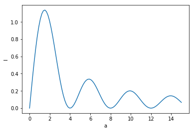

# PHYS-330 - Classical Mechanics - Fall 2017

## Homework 4

**Due:** 28th Sept 2017 by the start of class. Anything later will be considered late.
Instructions: Complete all of the questions below. You are encouraged to use Jupyter Notebooks to complete any numerical work and written. While the use of python is encouraged, you can use any programming language you want. You can either email me your assignment **as a single pdf document** or provide me with a hard copy in class.  

1. A particle of mass $m$ moves under gravity on a frictionless vertical wire of radius $R$.  At time $t=0$ the particle is travelling with speed $v_0$ at the top of the wire ($\theta = 0$).  
    a. Show that the magnitude of the force that the wire exerts on the particle is,  
    $$
        N(\theta) = mg(3\cos\theta - 2 - v_0^2/Rg).
    $$
    b. Show that the period $T$ of the motion is given by  
    $$
            T = \frac{2R}{v_0} \int_0^\pi \frac{d\theta}{\sqrt{1 +(4Rg/v_0^2)\sin^2(\theta/2)}}.
    $$
    Evaluate the period $T$ numerically and plot the graph of $T$ versus $(v_0/\sqrt{Rg})$.  Make the units of $T$ be $\sqrt{R/g}$. 
2. Consider a particle of mass $m$ acted on by a force $\mathbf{F}$ in an inertial frame.  
    a. Prove that 
    $$
        dK = \mathbf{F}\cdot d\mathbf{r}
    $$
    where $d\mathbf{r}$ is the change in the position vector of the particle in a time dt, and dK is the corresponding change in the kinetic energy $K=\frac{1}{2} mv^2$.   
     b. If $\mathbf{F}$ is conservative, show that
     $$
         \frac{d}{dt}(K+U) = 0
     $$
     c. Consider a time dependent force which can be expressed as the gradient of a scalar.  This means  
$$
    \mathbf{F}(x,t) = -\nabla U(\mathbf{r},t).
$$
show that
$$
    \frac{d}{dt}(K+U)=\frac{\partial U}{\partial t}
$$
3. A particle of mass $m$ is acted on by the one dimensional force
$$
    \mathbf{F} = (b \sin(\frac{2\pi x}{\lambda}))\hat{x}
$$
where $b, \lambda > 0$.  
    a. Sketch the energy diagram. ($U$ vs $x$)  
    b. For total energy $E > b\lambda/2\pi$, when is the velocity of the particle a maximum?  
    c. for $E < b\lambda/2\pi$, classify the turning points and the stable and unstable equilibrium points.
4. Consider a mass $m$ moving on a circular orbit due to an attractive (spherically symmetric) central force (the force of gravity is an example of such a field) with potential energy $U=kr^n$ where $n$ is a constant. Show that $T = nU/2$. (hint: use the fact that a spherically symmetric central force is conservative, section 4.8)
5. A particle of mass m is attached to a thin light inextensible string moves with speed $v_0$ in a circle with radius $r_0$.  What is the work required to reduce the radius from $r_0$ to $r$ by pulling the other end of the string perpendicular to the plane of the circle in terms of $m$, $v_0$, $r_0$ and $r$.

## Help for plotting and numerical integration

To numerically integrate $y=\sin 2\theta$ we can use the scipy.integrate library. This library contains many different methods for numerically solving an integral.  Below we use scipy's quad method to numerically evaluate the integral of $y$ from 0 to $\pi/2$.
$$
I = \int_0^{\pi/2} \sin a\theta\; d\theta = 1
$$
for $a=2$.


```python
import scipy.integrate as sci
import numpy as np
from matplotlib import pyplot as plt

'''
Below is how to implement the quadripole method from scipy

lambda x: np.sin(2*x)

defines a lambda function which we can integrate
'''
a,b = sci.quad(lambda x: np.sin(2*x),0,np.pi/2)

print("the integrals value is",a)
print("the absolute error is",b)
```

    the integrals value is 1.0
    the absolute error is 1.1102230246251565e-14


Now let's vary $a$ and plot I versus a.


```python
def evalint(a):
    """
    This function takes in a value a and evaluate the integral above.  
    It returns the value of the integral.
     """
    a, b = sci.quad(lambda x: np.sin(a*x),0,np.pi/2)
    return a

t = np.linspace(0,15,100) # t is the array of a values we are going to use
y = np.array([evalint(i) for i in t]) # this line creates an array of integral values 
                                    # which correspond to the values of t 

plt.plot(t,y)
plt.xlabel("a")
plt.ylabel("I")

plt.show()
```




